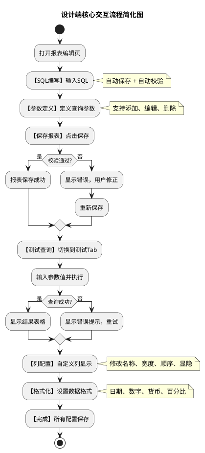

# 设计端功能交互设计文档

> **📌 文档说明**: 本文档基于设计元素分析，详细定义了设计端功能（US-001/002/003/004/005）的交互流程、交互反馈和状态管理规范，为前端开发提供完整的交互规范。
> **创建日期**: 2025-12-26
> **文档版本**: v1.0
> **目标用户**: 前端开发工程师、QA测试工程师、交互设计师

---

## 🔄 第1章：完整交互流程图

### 1.1 报表编辑完整流程（PlantUML活动图）

```plantuml
@startuml
title 程序员报表生成工具设计端完整交互流程

start
:用户进入报表管理首页;
note right: 已登录状态（US-014）

partition 报表选择阶段 {
  if (用户操作?) then (新建报表)
    :点击"新建报表"按钮;
    :按钮进入loading状态;
    :跳转到报表编辑页;
    :页面加载空白编辑表单;
    :按钮恢复可点击;
  else (编辑报表)
    :点击"编辑"按钮;
    :按钮进入loading状态;
    :跳转到报表编辑页;
    :加载报表信息（SQL、参数等）;
    :页面完全加载;
    :按钮恢复可点击;
  else (删除报表)
    :点击"删除"按钮;
    :弹出删除确认对话框;
    if (用户确认?) then (是)
      :发送删除请求;
      :显示删除成功提示（2秒消失）;
      :列表中移除报表;
    else (否)
      :关闭对话框;
      :返回列表;
    endif
  endif
}

partition SQL编写阶段 {
  :用户在SQL编辑器输入SQL;
  note right: 防抖200ms
  
  if (触发自动保存?) then (是)
    :后台保存SQL草稿;
  endif
  
  if (输入完成?) then (是)
    :自动触发安全校验;
    note right: 调用后端验证接口
  
    if (校验结果?) then (通过)
      :显示✅安全通过提示;
      :绿色背景，2秒自动消失;
    else (警告)
      :显示⚠️警告提示;
      :橙色背景，用户确认后消失;
    else (失败)
      :显示❌检测到危险关键字;
      :红色背景，禁用执行按钮;
      note right: 用户需修复SQL后重新提交
    endif
  endif
}

partition 参数定义阶段 {
  :用户点击"新增参数"按钮;
  :参数表单中新增一行;
  
  :用户输入参数信息;
  note right: 参数名、类型、默认值、必填标记
  
  if (参数操作?) then (编辑)
    :用户修改参数配置;
    :实时验证参数名唯一性;
  else (删除)
    :用户点击删除按钮;
    :参数行立即移除;
  endif
  
  if (继续添加?) then (是)
    :重复新增参数流程;
  else (否)
    :参数定义完成;
  endif
}

partition 报表保存阶段 {
  :用户点击"保存报表"按钮;
  :按钮进入loading状态，显示"保存中...";
  
  :后端验证报表信息;
  if (验证结果?) then (通过)
    :保存报表到数据库;
    :显示✅保存成功提示（3秒消失）;
    :按钮恢复可点击;
  else (失败)
    :显示❌错误提示（含具体原因）;
    :按钮恢复可点击;
    :用户修正后重新保存;
  endif
}

partition 查询测试阶段 {
  :用户切换到"测试查询"Tab;
  
  :系统生成参数输入表单;
  note right: 根据参数定义自动生成输入控件
  
  if (参数有默认值?) then (是)
    :自动填充默认值;
  endif
  
  :用户输入或选择参数值;
  :实时校验参数格式;
  
  if (参数校验?) then (失败)
    :在字段下方显示错误提示（红色）;
    :禁用执行按钮;
  else (通过)
    :启用执行按钮;
  endif
  
  :用户点击"执行查询"按钮;
  note right: 或按Ctrl+Enter快捷键
  :按钮进入loading状态;
  :显示加载动画和"正在执行...";
  
  if (查询超时?) then (是)
    :中止查询;
    :显示⏱️查询超时提示;
    :按钮恢复可点击;
  else (否)
    :后端返回结果集;
    :前端渲染结果表格;
    :显示"执行耗时: X秒 | 返回行数: X";
    :按钮恢复可点击;
  
    if (行数 > 10000?) then (是)
      :显示⚠️警告提示（超过10000行）;
    else (否)
      :结果加载完成;
    endif
  endif
}

partition 列配置阶段 {
  :用户切换到"列配置"Tab;
  
  :系统从查询结果加载列列表;
  note right: 展示所有返回的列
  
  :用户编辑列配置;
  if (操作类型?) then (修改显示名称)
    :双击列名进入编辑模式;
    :用户输入新的显示名称;
    :失焦时自动保存;
  else (调整列宽)
    :在列头与列头间拖拽调整;
    :实时显示新宽度值;
    :松开鼠标后保存;
  else (改变列顺序)
    :拖拽列行（行首的⋮图标）;
    :其他行自动移位;
    :松开鼠标后保存顺序;
  else (隐藏/显示列)
    :点击列行的眼睛图标;
    :立即切换显示状态;
    :自动保存配置;
  endif
  
  if (至少一列可见?) then (是)
    :配置有效;
  else (否)
    :显示⚠️至少需要显示一列;
    :禁用保存按钮;
  endif
  
  :用户点击"保存配置"按钮;
  :显示✅保存成功提示;
}

partition 格式化阶段 {
  :用户切换到"格式化"Tab;
  
  :系统展示可格式化的列列表;
  note right: 根据列的数据类型推荐格式类型
  
  :用户选择要格式化的列;
  :下拉框展开，显示该列的所有列;
  
  :用户选择格式类型;
  note right: 日期/数字/货币/百分比
  
  if (格式类型?) then (日期)
    :展示日期格式选项（yyyy-MM-dd等）;
    :用户选择格式;
    :实时预览格式化效果;
  else (数字)
    :展示小数位数输入框;
    :展示千位符开关;
    :用户配置参数;
    :实时预览效果;
  else (货币)
    :展示货币符号选择;
    :展示小数位数输入框;
    :展示千位符开关;
    :实时预览效果;
  else (百分比)
    :展示百分比格式选项;
    :实时预览效果;
  endif
  
  :用户点击"保存配置"按钮;
  :显示✅保存成功提示;
}

partition 报表完成 {
  :所有配置保存完成;
  :用户可点击"预览"查看最终效果;
  :或返回首页;
}

stop

@enduml
```

### 1.2 简化的核心流程图



---

## 🖱️ 第2章：关键交互点详细说明

### 2.1 SQL编辑器交互

| 交互元素      | 触发动作         | 响应效果                  | 目标状态    | 防抖/节流       | 备注                    |
| ------------- | ---------------- | ------------------------- | ----------- | --------------- | ----------------------- |
| sqlCodeEditor | 用户输入SQL      | 实时显示输入，光标闪烁    | 编辑中      | 200ms防抖       | 支持代码高亮、行号显示  |
| sqlCodeEditor | Ctrl+S           | 保存SQL草稿到本地存储     | -           | -               | 防止意外关闭丢失数据    |
| sqlCodeEditor | Ctrl+Shift+F     | 格式化SQL                 | SQL已格式化 | -               | 自动美化缩进            |
| sqlCodeEditor | Ctrl+Enter       | 执行查询（如果在测试Tab） | 查询执行    | 300ms节流       | 快捷键执行              |
| sqlCodeEditor | 失焦（输入完成） | 自动触发安全校验          | 校验中      | 200ms防抖后执行 | 后端验证SQL             |
| 安全校验提示  | 校验完成         | 显示✅/❌/⚠️提示        | 显示结果    | -               | 3种状态：成功/失败/警告 |
| 安全校验提示  | 用户点击关闭     | 提示消失                  | 隐藏        | -               | 错误提示需手动关闭      |

### 2.2 参数定义表单交互

| 交互元素           | 触发动作   | 响应效果             | 目标状态         | 防抖/节流 | 备注                                |
| ------------------ | ---------- | -------------------- | ---------------- | --------- | ----------------------------------- |
| 新增参数按钮       | 点击       | 参数表底部新增一行   | 新行处于编辑模式 | -         | 自动focus参数名输入框               |
| paramName输入框    | 输入参数名 | 实时验证参数名唯一性 | 验证中           | 300ms防抖 | 显示✓或✗提示                      |
| paramType下拉框    | 选择类型   | 根据类型切换输入控件 | 类型已选         | -         | String/Integer/Date/Decimal/Boolean |
| defaultValue输入框 | 输入默认值 | 实时验证格式         | 验证中           | 200ms防抖 | 格式必须匹配参数类型                |
| isRequired开关     | 切换       | 立即保存配置         | 状态已切换       | -         | 必填参数在查询时不能为空            |
| 删除按钮           | 点击       | 该参数行立即移除     | 行已删除         | -         | 删除前需确认（可选）                |
| 参数行             | 失焦       | 自动保存该行配置     | 配置已保存       | 200ms防抖 | 防止频繁保存                        |

### 2.3 查询执行交互

| 交互元素          | 触发动作             | 响应效果                   | 目标状态 | 防抖/节流 | 备注                           |
| ----------------- | -------------------- | -------------------------- | -------- | --------- | ------------------------------ |
| paramInput输入框  | 输入参数值           | 实时验证格式               | 验证中   | 200ms防抖 | 显示错误提示                   |
| dateRangePicker   | 选择日期             | 填充参数值，保存选择       | 已选     | -         | 支持快捷选择（近7天等）        |
| selectInput下拉框 | 选择值               | 填充参数值，关闭下拉框     | 已选     | -         | 支持搜索过滤                   |
| 参数表单          | 必填参数未填         | 禁用执行按钮               | disabled | -         | 按钮呈灰色、不可点击           |
| 参数表单          | 所有必填参数已填     | 启用执行按钮               | enabled  | -         | 按钮可点击，呈蓝色             |
| executeButton     | 点击（或Ctrl+Enter） | 按钮进入loading状态        | 执行中   | 300ms节流 | 显示加载动画                   |
| executeButton     | 加载中               | 按钮禁用，显示"执行中..."  | disabled | -         | 防止重复提交                   |
| 后端响应          | 成功返回结果         | 显示结果表格、耗时、行数   | 完成     | -         | <3秒显示成功，>3秒显示耗时提示 |
| 后端响应          | 返回错误             | 显示❌错误提示，按钮恢复   | 失败     | -         | 5秒后自动隐藏，或手动关闭      |
| 后端响应          | 查询超时             | 显示⏱️超时提示，中止查询 | 超时     | -         | 10秒无响应自动超时             |

### 2.4 列配置交互

| 交互元素             | 触发动作      | 响应效果                       | 目标状态 | 防抖/节流 | 备注                      |
| -------------------- | ------------- | ------------------------------ | -------- | --------- | ------------------------- |
| displayNameInput     | 双击列名      | 进入编辑模式，自动select文本   | 编辑中   | -         | 支持直接输入或按Enter保存 |
| displayNameInput     | 输入新名称    | 实时显示输入                   | 编辑中   | -         | 最多50字符                |
| displayNameInput     | 失焦或按Enter | 自动保存新名称                 | 已保存   | 200ms防抖 | 如果为空则恢复原名称      |
| columnWidthInput     | 输入宽度      | 验证范围（50-500px）           | 验证中   | 200ms防抖 | 范围外显示错误提示        |
| columnWidthInput     | 失焦          | 自动保存宽度，表格列宽实时更新 | 已保存   | 200ms防抖 | 立即应用新宽度            |
| dragHandle拖拽       | 拖拽行        | 显示拖拽反馈（行背景变色）     | 拖拽中   | -         | 拖拽时禁用其他操作        |
| dragHandle拖拽       | 松开鼠标      | 行移动到新位置，保存顺序       | 已保存   | -         | 其他行自动调整顺序        |
| visibilityToggle开关 | 点击          | 切换列显示/隐藏                | 已切换   | -         | 表格实时更新列显示        |
| visibilityToggle开关 | 所有列都隐藏  | 显示⚠️提示（至少需显示1列）  | 警告     | -         | 禁用保存按钮              |
| 保存配置按钮         | 点击          | 按钮loading，保存到后端        | 保存中   | 300ms节流 | 完成后显示✅成功提示      |

### 2.5 格式化配置交互

| 交互元素             | 触发动作     | 响应效果                  | 目标状态   | 防抖/节流 | 备注                     |
| -------------------- | ------------ | ------------------------- | ---------- | --------- | ------------------------ |
| columnSelector下拉框 | 点击         | 展开列列表                | 展开       | -         | 支持搜索过滤列           |
| columnSelector下拉框 | 选择列       | 关闭下拉框，加载该列配置  | 已选       | -         | 自动推荐合适的格式类型   |
| formatTypeSelect     | 选择类型     | 根据类型显示对应参数控件  | 类型已切换 | -         | 日期/数字/货币/百分比4种 |
| dateFormatSelect     | 选择日期格式 | 实时预览格式化效果        | 预览更新   | 100ms节流 | 显示示例如"2025-12-26"   |
| decimalPlacesInput   | 输入小数位数 | 验证范围（0-4），实时预览 | 预览更新   | 100ms节流 | 显示示例如"1,234.56"     |
| currencySymbolSelect | 选择符号     | 实时预览格式化效果        | 预览更新   | -         | 显示示例如"¥1,234.56"   |
| 千位符开关           | 切换         | 立即更新预览              | 预览更新   | -         | 同时更新示例             |
| formatPreview预览框  | 加载中       | 显示loading动画           | 加载中     | -         | 正在计算预览效果         |
| 保存配置按钮         | 点击         | 按钮loading，保存到后端   | 保存中     | 300ms节流 | 完成后显示✅成功提示     |

---

## 💬 第3章：交互反馈设计

### 3.1 成功反馈

| 场景            | 反馈文案                            | 视觉样式                   | 显示位置      | 持续时间    | 关闭方式               |
| --------------- | ----------------------------------- | -------------------------- | ------------- | ----------- | ---------------------- |
| SQL安全校验通过 | ✅ 安全通过 - 此SQL语句可以安全执行 | 绿色背景 #52c41a，白色文字 | SQL编辑器下方 | 2秒自动消失 | 自动消失或用户点击关闭 |
| 参数定义保存    | ✅ 参数已保存                       | 绿色背景 #52c41a，白色文字 | 参数表下方    | 2秒自动消失 | 自动消失               |
| 报表保存成功    | ✅ 报表已保存成功                   | 绿色背景 #52c41a，白色文字 | 页面顶部弹出  | 3秒自动消失 | 自动消失               |
| 查询执行成功    | ✅ 查询执行成功，耗时 X秒，返回 X行 | 绿色背景 #52c41a，白色文字 | 结果表格上方  | 2秒自动消失 | 自动消失               |
| 列配置保存成功  | ✅ 列配置已保存                     | 绿色背景 #52c41a，白色文字 | 列配置表下方  | 2秒自动消失 | 自动消失               |
| 格式化配置保存  | ✅ 格式化配置已保存                 | 绿色背景 #52c41a，白色文字 | 格式化表下方  | 2秒自动消失 | 自动消失               |

### 3.2 错误反馈

| 场景              | 反馈文案                                                                                             | 视觉样式                   | 显示位置         | 持续时间    | 关闭方式                    |
| ----------------- | ---------------------------------------------------------------------------------------------------- | -------------------------- | ---------------- | ----------- | --------------------------- |
| SQL包含危险关键字 | ❌ 检测到危险关键字：DROP``问题：您的SQL包含DROP语句，会删除表``建议：仅使用SELECT语句 | 红色边框 #f5222d，红色背景 | SQL编辑器下方    | 不自动消失  | 手动关闭或修正SQL后重新校验 |
| SQL长度超过限制   | ❌ SQL长度超过限制``当前：12000字符，限制：10000字符                                          | 红色边框 #f5222d           | SQL编辑器下方    | 不自动消失  | 手动关闭或删除内容          |
| 参数名重复        | ❌ 参数名已存在``请使用不同的参数名                                                           | 红色边框 #f5222d           | 参数名输入框下方 | 不自动消失  | 修改参数名后自动消失        |
| 参数格式错误      | ❌ 默认值格式不符``期望：日期格式(yyyy-MM-dd)，实际：2025-13-01                               | 红色边框 #f5222d           | 输入框下方       | 不自动消失  | 修正后自动消失              |
| 报表保存失败      | ❌ 保存失败``错误：数据库连接异常，请稍后重试                                                 | 红色背景 #f5222d，白色文字 | 页面顶部弹出     | 5秒自动消失 | 自动消失或点击关闭          |
| 查询执行失败      | ❌ 查询执行失败``错误：SQL语法错误，行5列12``建议：检查WHERE子句语法                   | 红色背景 #f5222d，白色文字 | 结果表格上方     | 5秒自动消失 | 自动消失或手动关闭          |
| 查询超时          | ⏱️ 查询超时``查询已执行超过5秒，已中止``建议：优化SQL或增加WHERE条件                 | 红色背景 #f5222d，白色文字 | 结果表格上方     | 不自动消失  | 手动关闭                    |
| 参数验证失败      | ❌ 参数验证失败``必填参数"startDate"未填写                                                    | 红色边框 #f5222d           | 输入框下方       | 不自动消失  | 填写后自动消失              |

### 3.3 警告反馈

| 场景               | 反馈文案                                                                                                      | 视觉样式                   | 显示位置      | 持续时间   | 关闭方式                       |
| ------------------ | ------------------------------------------------------------------------------------------------------------- | -------------------------- | ------------- | ---------- | ------------------------------ |
| SQL存在注释符号    | ⚠️ 警告：SQL包含注释符号（--或/**/）``这可能被用于SQL注入，建议移除                                  | 橙色背景 #faad14，深灰文字 | SQL编辑器下方 | 不自动消失 | 用户确认后消失或修正后重新校验 |
| 查询返回超大结果集 | ⚠️ 警告：查询返回超过10000行``实际返回：15234行，仅显示前10000行``建议：增加WHERE条件筛选数据 | 橙色背景 #faad14，深灰文字 | 结果表格上方  | 不自动消失 | 手动关闭                       |
| 列全部隐藏         | ⚠️ 错误：至少需要显示一列``请至少保留一列为显示状态                                                  | 橙色背景 #faad14，深灰文字 | 列配置表下方  | 不自动消失 | 取消隐藏任意一列后自动消失     |
| 参数未在SQL中使用  | ⚠️ 提示：参数"salesman"未在SQL中使用``已定义的参数建议在SQL中引用                                    | 橙色背景 #faad14，深灰文字 | 参数表下方    | 不自动消失 | 用户确认或修正后消失           |

### 3.4 加载反馈

| 场景           | 反馈文案                | 视觉样式                            | 显示位置      | 持续时间   | 说明      |
| -------------- | ----------------------- | ----------------------------------- | ------------- | ---------- | --------- |
| SQL校验中      | 正在校验SQL安全性...    | 蓝色背景 #1890ff，loading动画       | SQL编辑器下方 | 显示至完成 | 不超过2秒 |
| 查询执行中     | 正在执行查询，请等候... | 蓝色背景 #1890ff，loading动画       | 结果表格上方  | 显示至完成 | 最多5秒   |
| 报表保存中     | 正在保存报表...         | 蓝色背景 #1890ff，loading动画       | 页面顶部      | 显示至完成 | 不超过3秒 |
| 配置保存中     | 正在保存配置...         | 蓝色背景 #1890ff，loading动画       | 按钮内部      | 显示至完成 | 不超过2秒 |
| 格式预览计算中 | 正在计算预览效果...     | 蓝色background #1890ff，loading动画 | 预览框内      | 显示至完成 | 实时预览  |

### 3.5 信息提示

| 场景         | 反馈文案                                    | 视觉样式                   | 显示位置        | 持续时间      | 关闭方式           |
| ------------ | ------------------------------------------- | -------------------------- | --------------- | ------------- | ------------------ |
| SQL代码提示  | 💡 提示：在SQL中使用参数占位符 #{paramName} | 蓝色背景 #1890ff，白色文字 | SQL编辑器右下角 | 5秒后自动消失 | 自动消失或点击关闭 |
| 参数类型说明 | 💡 Integer：整数类型，例如 2025             | 蓝色背景 #1890ff，白色文字 | 参数表旁        | 不自动消失    | hover消失          |
| 列宽范围提示 | 💡 列宽范围：50-500px                       | 浅灰背景，深灰文字         | 宽度输入框下方  | hover时显示   | hover消失          |
| 格式预览说明 | 💡 预览：数据将按选定格式展示               | 浅蓝背景                   | 预览框上方      | 持续显示      | -                  |

---

## 📊 第4章：状态流转定义

### 4.1 页面整体状态机

| 当前状态         | 触发事件            | 目标状态       | 附带动作                             | 说明                             |
| ---------------- | ------------------- | -------------- | ------------------------------------ | -------------------------------- |
| 初始化加载       | 页面加载完成        | 编辑初始状态   | 清空所有输入框，加载模板（如果编辑） | 新建：空表单；编辑：加载已有数据 |
| 编辑初始状态     | 用户输入SQL         | SQL编辑中      | 显示编辑提示，启动autosave           | -                                |
| SQL编辑中        | 完成输入（失焦）    | SQL待校验      | 触发安全校验                         | 调用后端验证                     |
| SQL待校验        | 校验中...           | SQL校验中      | 显示loading动画                      | -                                |
| SQL校验中        | 校验通过            | SQL已通过      | 显示✅提示，可保存                   | -                                |
| SQL校验中        | 校验失败            | SQL有警告/错误 | 显示⚠️或❌，禁用执行               | -                                |
| SQL已通过/有警告 | 用户点击保存        | 报表保存中     | 按钮loading，发送保存请求            | -                                |
| 报表保存中       | 保存成功            | 报表已保存     | 显示✅提示，恢复按钮                 | -                                |
| 报表保存中       | 保存失败            | SQL已通过      | 显示❌提示，恢复按钮                 | 用户可重试                       |
| SQL已通过        | 用户切换到测试Tab   | 测试查询中     | 生成参数输入表单                     | -                                |
| 测试查询中       | 用户填参数、执行    | 查询执行中     | 按钮loading，显示"执行中"            | -                                |
| 查询执行中       | 执行成功            | 结果已加载     | 渲染结果表格，显示统计               | 可进行列配置                     |
| 查询执行中       | 执行失败            | 查询失败       | 显示❌错误提示，恢复按钮             | -                                |
| 查询执行中       | 超时（5秒）         | 查询超时       | 显示⏱️提示，中止查询               | -                                |
| 结果已加载       | 用户切换到列配置Tab | 列配置中       | 加载列列表供编辑                     | -                                |
| 列配置中         | 用户修改列配置      | 列配置待保存   | 显示修改标记                         | -                                |
| 列配置待保存     | 用户点击保存        | 列配置保存中   | 按钮loading                          | -                                |
| 列配置保存中     | 保存成功            | 列配置已保存   | 显示✅提示，表格更新                 | -                                |
| 列配置已保存     | 用户切换到格式化Tab | 格式化配置中   | 加载格式化配置供编辑                 | -                                |
| 格式化配置中     | 用户修改格式        | 格式化待保存   | 实时预览更新                         | -                                |
| 格式化待保存     | 用户点击保存        | 格式化保存中   | 按钮loading                          | -                                |
| 格式化保存中     | 保存成功            | 格式化已保存   | 显示✅提示，结果表更新               | -                                |
| 任意状态         | 用户点击删除        | 删除确认       | 弹出确认对话框                       | -                                |
| 删除确认         | 用户确认删除        | 删除中         | 显示loading                          | -                                |
| 删除中           | 删除成功            | 返回首页       | 显示✅提示，重定向                   | -                                |

### 4.2 SQL编辑器状态细节

```
┌─────────────┐
│   空闲状态   │
└──────┬──────┘
       │ 用户输入
       ▼
┌─────────────┐
│  编辑中      │
│ (autosave)  │
└──────┬──────┘
       │ 失焦或2秒无输入
       ▼
┌─────────────┐
│  校验中      │
│ (loading)   │
└──────┬──────┘
       │
   ┌───┴───┐
   │       │
   ▼       ▼
┌────┐  ┌──────┐
│通过│  │失败  │
└────┘  └──────┘
```

### 4.3 查询执行状态细节

```
┌──────────────┐
│  参数表单    │
│   初始状态    │
└──────┬───────┘
       │ 用户输入参数
       ▼
┌──────────────┐
│ 参数验证中    │
│ (实时校验)    │
└──────┬───────┘
       │
   ┌───┴───┐
   │       │
   ▼       ▼
┌────┐  ┌──────┐
│通过│  │失败  │
└────┘  └──────┘
│
│ 点击执行
▼
┌──────────────┐
│  查询执行中   │
│  (loading)   │
│  (最多5秒)    │
└──────┬───────┘
       │
   ┌───┴───┬────┐
   │       │    │
   ▼       ▼    ▼
┌────┐  ┌──┐  ┌───┐
│成功│  │失│  │超│
│    │  │败│  │时│
└────┘  └──┘  └───┘
```

### 4.4 组件状态矩阵

#### SQL编辑器

| 组件   | 默认态             | hover    | focus    | disabled | loading | error    |
| ------ | ------------------ | -------- | -------- | -------- | ------- | -------- |
| 编辑框 | 白色背景，黑色文字 | 浅灰边框 | 蓝色边框 | 灰色背景 | -       | 红色边框 |
| 行号   | 灰色               | 灰色     | 蓝色     | 灰色     | -       | 灰色     |
| 光标   | 黑色竖线闪烁       | 同上     | 快速闪烁 | 隐藏     | -       | 红色竖线 |

#### 按钮

| 按钮 | 默认态             | hover      | active   | disabled           | loading               |
| ---- | ------------------ | ---------- | -------- | ------------------ | --------------------- |
| 保存 | 蓝色背景，白色文字 | 深蓝色背景 | 更深蓝   | 灰色背景，灰色文字 | 蓝色背景，loading动画 |
| 执行 | 蓝色背景，白色文字 | 深蓝色背景 | 更深蓝   | 灰色背景，灰色文字 | 蓝色背景，loading动画 |
| 删除 | 红色文字           | 浅红背景   | 深红     | 灰色文字           | -                     |
| 取消 | 灰色边框，灰色文字 | 浅灰背景   | 深灰背景 | -                  | -                     |

#### 表单输入框

| 组件     | 默认态             | hover          | focus              | disabled           | error              |
| -------- | ------------------ | -------------- | ------------------ | ------------------ | ------------------ |
| 输入框   | 白色背景，浅灰边框 | 浅灰边框       | 蓝色边框，蓝色阴影 | 灰色背景，灰色文字 | 红色边框，浅红背景 |
| 下拉框   | 白色背景，灰色箭头 | 灰色边框       | 蓝色边框           | 灰色背景           | 红色边框           |
| 日期选择 | 白色背景，灰色边框 | 灰色边框       | 蓝色边框           | 灰色背景           | 红色边框           |
| 开关     | off灰色，on蓝色    | 同上（加阴影） | 同上               | 灰色               | -                  |

---

## ✅ 第5章：特殊场景处理

### 5.1 防重复提交机制

**场景**: 用户点击"保存"或"执行"按钮

**处理流程**:

1. 用户点击按钮

   - 按钮立即变为disabled状态（灰色）
   - 显示"保存中..."或"执行中..."文字
   - 显示loading动画（旋转圆圈）
2. 请求发送后

   - 即使用户快速点击，也不会发送新请求
   - 防止多次提交（服务端也应实现防重复）
3. 请求完成

   - 按钮恢复enabled状态（蓝色）
   - 显示完成状态（成功✅或失败❌）
   - 2-3秒后恢复原始文字

### 5.2 长时间等待处理

**场景**: 查询执行超过3秒

**处理流程**:

1. 第1秒

   - 显示"正在执行..."
   - loading动画持续旋转
2. 第3秒

   - 显示"正在执行...（已耗时3秒）"
   - 提示用户查询较慢
3. 第5秒

   - 如果还未完成，自动超时
   - 显示⏱️超时提示
   - 提示用户优化SQL或增加WHERE条件

### 5.3 网络错误处理

**场景**: API请求失败

**处理流程**:

1. 检测到错误

   - 立即显示❌错误提示
   - 包含具体错误信息
2. 提供重试选项

   - 显示"重试"按钮
   - 用户可重新发送请求
3. 恢复操作

   - 5秒后自动隐藏错误提示
   - 相关按钮恢复enabled状态

### 5.4 浏览器关闭保护

**场景**: 用户意外关闭浏览器或页面

**处理流程**:

1. SQL编辑器

   - 实时保存到localStorage
   - 2秒一次自动保存
   - 页面重新加载时恢复
2. 参数表单

   - 失焦时自动保存到后端
   - 不依赖本地存储
3. 离开页面前

   - 如有未保存更改，显示确认对话框
   - "确定要离开？未保存的更改将丢失"

### 5.5 并发操作处理

**场景**: 用户快速切换Tab或执行多个操作

**处理流程**:

1. Tab切换时

   - 第一个Tab中的请求仍在进行
   - 切换到第二个Tab，不中止第一个Tab的请求
   - 两个Tab可独立操作
2. 同时修改多个字段

   - 字段分别防抖（200-300ms）
   - 各自独立保存
   - 不会相互影响
3. 快速点击相同按钮

   - 第一次点击禁用按钮
   - 后续点击被忽略
   - 第一个请求完成后恢复

---

## 🎨 第6章：动画与过渡效果

### 6.1 页面转场动画

| 转场       | 动画类型                     | 时长  | 说明               |
| ---------- | ---------------------------- | ----- | ------------------ |
| 编辑页进入 | 淡入（fade-in）              | 200ms | 从首页进入编辑页   |
| 编辑页离开 | 淡出（fade-out）             | 200ms | 从编辑页返回首页   |
| Tab切换    | 内容淡入                     | 150ms | 在编辑页内切换Tab  |
| 对话框出现 | 缩放+淡入（zoom-in + fade）  | 200ms | 删除确认对话框出现 |
| 对话框关闭 | 缩放+淡出（zoom-out + fade） | 200ms | 对话框关闭         |

### 6.2 组件动画

| 组件         | 动画             | 时长     | 说明                                 |
| ------------ | ---------------- | -------- | ------------------------------------ |
| 提示信息     | 淡入→持续→淡出 | 2000ms总 | 成功提示自动消失                     |
| 加载动画     | 旋转（360度/s）  | 循环     | loading图标不断旋转                  |
| 错误提示     | 闪动（1次）      | 200ms    | 输入框边框红色闪动提示错误           |
| 按钮状态变化 | 背景色过渡       | 150ms    | 按钮hover/disabled状态平滑过渡       |
| 列拖拽       | 实时跟踪         | 0ms延迟  | 拖拽时行高亮，松开时动画回到目标位置 |
| 列宽调整     | 实时更新         | 0ms延迟  | 拖拽列头时列宽实时变化               |

### 6.3 禁用/启用动画

| 状态         | 动画                 | 时长  |
| ------------ | -------------------- | ----- |
| 按钮disabled | 背景色逐渐变灰       | 100ms |
| 按钮enabled  | 背景色恢复           | 100ms |
| 输入框禁用   | 背景色变灰，文字变灰 | 100ms |
| 输入框启用   | 恢复原色             | 100ms |

---

## 🔑 第7章：快捷键支持

| 快捷键       | 功能         | 上下文      | 说明                   |
| ------------ | ------------ | ----------- | ---------------------- |
| Ctrl+S       | 保存报表     | 编辑页      | 快速保存，触发保存流程 |
| Ctrl+Enter   | 执行查询     | 测试查询Tab | 快速执行查询           |
| Ctrl+Shift+F | 格式化SQL    | SQL编辑器   | 美化SQL缩进和格式      |
| Tab          | 切换输入焦点 | 参数表单    | 在参数输入框间移动焦点 |
| Enter        | 保存/确认    | 各输入框    | 按Enter保存编辑        |
| Esc          | 取消编辑     | 编辑模式    | 取消当前编辑，恢复原值 |
| Ctrl+/       | 注释代码     | SQL编辑器   | 快速注释SQL代码        |

---

## 📋 第8章：交互规范检查清单

- [X] 是否设计了完整的用户交互流程？
- [X] 是否覆盖了所有关键交互点（25+）？
- [X] 是否定义了交互反馈（成功/错误/警告/加载/信息）？
- [X] 是否定义了状态流转逻辑？
- [X] 是否处理了特殊场景（防重复、长等待、网络错误等）？
- [X] 是否设计了动画效果？
- [X] 是否定义了快捷键？
- [X] 所有反馈提示是否包含（文案、样式、位置、时长、关闭方式）？

---

## 🔗 第9章：相关文档

- [设计端功能设计元素分析](./设计端功能设计元素分析.md) - UI组件、数据字段、设计约束
- [Must Have 用户故事详细清单](./Must-Have用户故事详细清单.md) - US-001/002/003/004/005完整定义
- [用户故事质量评估与优先级排序](./用户故事质量评估与优先级排序.md) - 优先级和依赖关系

---

**文档版本**: v1.0
**最后更新**: 2025-12-26
**作者**: AI敏捷交互设计
**审核状态**: ⏳ 待交互设计师和前端开发审核

**关键指标**:

- ✅ 完整的活动图流程（PlantUML代码）
- ✅ 25+个关键交互点详细说明
- ✅ 4类交互反馈设计（成功/错误/警告/加载）
- ✅ 完整的状态流转定义
- ✅ 5个特殊场景处理规范
- ✅ 动画、快捷键等补充规范
- 🎯 交互设计文档已准备完毕，可用于前端开发和QA测试用例设计
